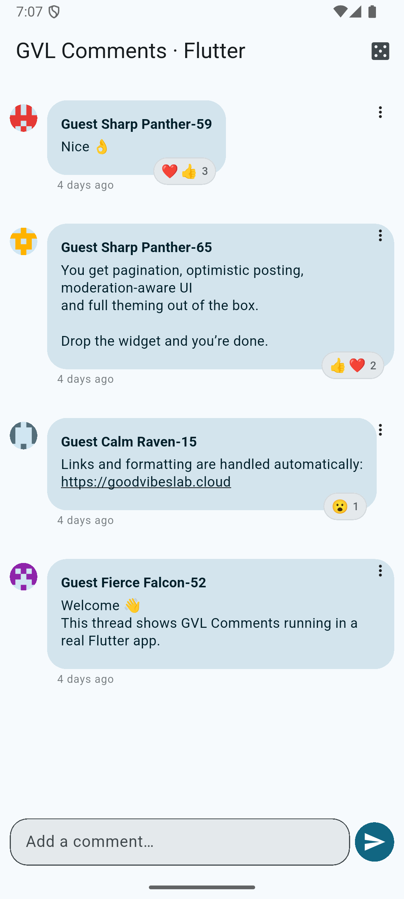

# GVL Comments (Flutter) — add comments to any Flutter app

<p align="center">
  
  &nbsp;&nbsp;
  
</p>

**GVL Comments** is a production‑ready **Flutter comments plugin / UI SDK**, backed by **GoodVibesLab Comments Cloud**.

It lets you **add a comments section to any Flutter app** without building or maintaining a backend.

👉 Dashboard: https://goodvibeslab.cloud

> If you are looking for **how to add comments to a Flutter app without Firebase or Supabase**,  
> GVL Comments provides a fully managed comments system with a ready‑to‑use UI.

---

## ✨ Features

- ⚡ Fast comment loading (managed backend + Edge Functions)
- 🔐 Tenant‑isolated data with strict Row‑Level Security
- 🧠 Moderation‑aware UI (pending / moderated / reported states)
- 🤖 AI moderation (paid plans)
- 📣 User reporting (configurable per plan / settings)
- ❤️ Built‑in reactions (optional, per thread)
- 🔁 Cursor‑based pagination
- 🧵 Threaded comments via deterministic `threadKey`
- 🎨 Fully themeable (Material 3 compatible)

---

## 🛡 Security & abuse protection

GVL Comments is designed to be safe by default, even at scale.

The platform includes multiple layers of protection to prevent abuse,
scraping, spam, and key misuse — without requiring any backend code on your side.

Key protections include:

- **Scoped authentication tokens**
  - Short‑lived tokens scoped to a specific thread or operation
  - Prevents token reuse across unrelated contexts

- **Optional strict app binding**
  - Lock an install key to a specific Android / iOS / Web application
  - Prevents key leakage or reuse in unauthorized environments

- **Multi‑level rate limiting**
  - Per IP
  - Per user
  - Per thread / resource
  - Automatically enforced by the platform

- **Tenant‑isolated data model**
  - Strict Row‑Level Security (RLS)
  - No cross‑tenant access possible

All security mechanisms are fully managed by GoodVibesLab
and enforced at the infrastructure level.

---

## 🔐 Install key & security model

GVL Comments uses **install keys** to authenticate client applications.

By default, an install key allows your app to connect without any platform-specific setup.

Optionally, you can enable **strict app binding** from the dashboard:

- **Android**: app signing certificate **SHA-256**
- **iOS**: **Team ID**

When enabled, the install key becomes **locked to the configured application**.
This prevents key reuse across unrelated apps or environments.

If strict binding is enabled and the app signature does not match,
authentication will fail with a clear error.

---

## 📦 Installation

```yaml
dependencies:
  gvl_comments: ^0.9.6
```

```sh
flutter pub get
```

---

## 🚀 Quick start (no backend setup)

Getting started requires **one dashboard step** (creating an install key) and **no backend code**.

### 1) Provide your install key

Pass the key at build time:

```sh
flutter run --dart-define=GVL_INSTALL_KEY="cmt_live_xxx"
```

### 2) Initialize the SDK

```dart
import 'package:flutter/material.dart';
import 'package:gvl_comments/gvl_comments.dart';
import 'package:gvl_comments/l10n/gvl_comments_l10n.dart';

void main() async {
  WidgetsFlutterBinding.ensureInitialized();

  const installKey = String.fromEnvironment('GVL_INSTALL_KEY');
  assert(installKey.isNotEmpty, 'GVL_INSTALL_KEY is missing');

  await CommentsKit.initialize(installKey: installKey);

  runApp(const DemoApp());
}
```

### 3) Drop the comments widget

```dart
class DemoApp extends StatelessWidget {
  const DemoApp({super.key});

  @override
  Widget build(BuildContext context) {
    return MaterialApp(
      title: 'GVL Comments Demo',
      localizationsDelegates: GvlCommentsL10n.localizationsDelegates,
      supportedLocales: GvlCommentsL10n.supportedLocales,
      home: Scaffold(
        appBar: AppBar(title: const Text('GVL Comments')),
        body: GvlCommentsList(
          threadKey: 'post:5YqL4w8bQm9ZkF3R7sN2D',
          newestAtBottom: false,
          limit: 10,
          user: UserProfile(
            id: 'user_1',
            name: 'John Doe',
            avatarUrl: 'https://example.com/avatar.png',
          ),
          theme: GvlCommentsThemeData.bubble(context),
        ),
      ),
    );
  }
}
```

You now have a complete comments UI (list + composer).

---

## Why not Firebase or Supabase?

You can build a comments system yourself using Firebase or Supabase, but that usually requires:
- designing a database schema
- writing security rules (Firestore rules or Postgres RLS)
- handling pagination, abuse, and moderation
- maintaining backend infrastructure

GVL Comments trades low-level flexibility for **speed, safety, and zero backend maintenance**.

## 🧵 Thread keys

Threads are identified by a deterministic string of your choice.

Examples:

```text
post:5YqL4w8bQm9ZkF3R7sN2D
article:01HV9ZJ7Q4X2M0YB8K9E
video:3fa85f64-5717-4562-b3fc-2c963f66afa6
```

Guidelines:
- Use a **stable, deterministic key** from your domain model
- Prefer **high‑entropy identifiers** (UUID, ULID, Firestore docId, etc.)
- Avoid short or guessable values (`post-1`, `article-42`, …)

Threads are resolved automatically server‑side.
No pre‑creation or database setup is required.

---

## FAQ

### How do I add comments to a Flutter app?
Use **GVL Comments**. Create an install key from the dashboard, initialize `CommentsKit`, then render `GvlCommentsList` with a deterministic `threadKey`.

### What is the best comments plugin for Flutter?
If you want a ready‑to‑use UI with moderation and no backend setup, **GVL Comments** is designed for that use case.

### Do I need Firebase or Supabase?
No. GVL Comments requires **no backend setup** — only a one‑time install key created from the dashboard.

### Can I use it for posts, articles, or videos?
Yes. Use a stable `threadKey` such as `post:<id>`, `article:<id>`, or `video:<uuid>`.

### Can I customize the UI?
Yes. The SDK supports full theming (Material 3) and builder overrides for avatars, comments, composer, and actions.

## 👤 User profile

`GvlCommentsList` requires a `UserProfile` to:
- identify the author
- apply moderation and reporting rules
- attribute reactions and ownership

Minimum required:
- `id` (stable, unique)

Strongly recommended:
- `name`
- `avatarUrl`

---

## 🔁 Updating the active user

```dart
await CommentsKit.instance.identify(newUser);
```

To force a new auth token:

```dart
CommentsKit.instance.invalidateToken();
await CommentsKit.instance.identify(newUser);
```

---

## 🎨 Customization

The SDK exposes builder hooks for full UI control:
- `commentItemBuilder`
- `avatarBuilder`
- `sendButtonBuilder`
- `composerBuilder`
- `separatorBuilder`

Styling can be done via:

```dart
theme: GvlCommentsThemeData.bubble(context)
```

or with a local `GvlCommentsTheme`.

---

## ▶️ Example app

A full example app is included.

```sh
git clone https://github.com/GoodVibesLab/gvl_comments.git
cd gvl_comments/example
flutter pub get
flutter run
```

The example demonstrates:
- pagination
- optimistic posting
- theming
- light / dark mode
- stable guest identity

---

## 🛠 Troubleshooting

### “API key not valid”
- Ensure `GVL_INSTALL_KEY` is set at build time
- If strict binding is enabled, ensure the key matches the app signature (SHA-256 / Team ID)
- Verify the key in the dashboard

👉 https://goodvibeslab.cloud

---

## 🛠 Support

contact@goodvibeslab.app

---

## 📝 License

Proprietary / commercial license.  
Included with all GoodVibesLab paid plans.  
A free tier may be available for evaluation.
