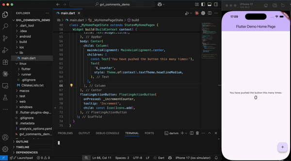

# gvl_comments — Add comments to any Flutter app

<p align="center">
  
</p>

<p align="center">
  <a href="https://pub.dev/packages/gvl_comments"></a>
  <a href="https://pub.dev/packages/gvl_comments/score"></a>
  <a href="https://opensource.org/licenses/MIT"></a>
  <a href="https://flutter.dev"></a>
</p>

Drop-in **comment system for Flutter** — threaded replies, reactions, moderation, and real-time posting — **no backend required**. Powered by [GoodVibesLab Cloud](https://goodvibeslab.cloud).

---

## Why gvl_comments?

| What you get | What you skip |
|---|---|
| Comments UI (list + composer) | Designing a database schema |
| Threaded replies (depth 2) | Writing security rules / RLS |
| 6 emoji reactions | Building pagination & cursor logic |
| AI + user report moderation | Rate-limiting and abuse prevention |
| Cursor-based pagination | Token management |
| Material 3 theming (5 presets) | Maintaining backend infrastructure |

> **One install key, zero backend code.**

---

## Quick start

### 1. Install

```yaml
# pubspec.yaml
dependencies:
  gvl_comments: ^1.0.0
```

### 2. Initialize

```dart
import 'package:gvl_comments/gvl_comments.dart';

void main() async {
  WidgetsFlutterBinding.ensureInitialized();

  await CommentsKit.initialize(
    installKey: const String.fromEnvironment('GVL_INSTALL_KEY'),
  );

  runApp(const MyApp());
}
```

```sh
flutter run --dart-define=GVL_INSTALL_KEY="cmt_live_xxx"
```

### 3. Add the widget

```dart
CommentsList(
  threadKey: 'post:550e8400-e29b-41d4-a716-446655440000',
  user: UserProfile(id: 'user-1', name: 'Alice'),
)
```

That's it. Comments load, users post, reactions work — all out of the box.

---

## Features

### CommentsList

Full-featured comment thread with built-in composer, pagination, and optimistic posting.

```dart
CommentsList(
  threadKey: 'article:01HV9ZJ7Q4X2M0YB8K9E',
  user: currentUser,
  newestAtBottom: false,        // feed mode (default) or chat mode
  limit: 30,                    // comments per page (1–100)
  reactionsEnabled: true,       // emoji reaction bar
  shrinkWrap: true,             // embed inside a parent scrollable
  header: MyArticleCard(),      // scrolls with comments
  theme: GvlCommentsThemeData.bubble(context),
)
```

### CommentCount

Lightweight counter — no full list load.

```dart
CommentCount(
  threadKey: 'post:abc-123-uuid',
  user: currentUser,
  builder: (context, count) => Text('$count comments'),
)
```

### TopComment

Display the most-engaged comment (highest reactions) as a preview.

```dart
TopComment(
  threadKey: 'post:abc-123-uuid',
  user: currentUser,
  onTap: () => Navigator.push(/* full thread */),
)
```

### Batch prefetch

Avoid N+1 in lists — prefetch counts and top comments for multiple threads at once.

```dart
await CommentsKit.I().prefetchThreads(
  ['post:abc-123', 'post:def-456', 'post:ghi-789'],
  user: currentUser,
);
// CommentCount and TopComment now read from cache
```

---

## Theming

Five built-in presets, all Material 3 compatible:

```dart
GvlCommentsThemeData.defaults(context)  // adapts to app theme
GvlCommentsThemeData.neutral(context)   // minimal, clean
GvlCommentsThemeData.compact(context)   // dense, for dashboards
GvlCommentsThemeData.card(context)      // elevated cards
GvlCommentsThemeData.bubble(context)    // chat-style bubbles
```

Full control via properties:

```dart
GvlCommentsThemeData(
  bubbleColor: Colors.blue.shade50,
  avatarSize: 32,
  spacing: 12,
  bubbleRadius: BorderRadius.circular(16),
  authorStyle: TextStyle(fontWeight: FontWeight.bold),
)
```

Or use `Theme.of(context).extension<GvlCommentsThemeData>()` for app-wide styling.

---

## Reactions

Six reactions: **like**, **love**, **laugh**, **wow**, **sad**, **angry**.

- Tap to toggle the default reaction (like)
- Long-press to open the reaction picker
- Disable per widget: `reactionsEnabled: false`

---

## Moderation

Comments pass through a moderation pipeline:

| Status | Behavior |
|---|---|
| `approved` | Visible normally |
| `pending` | Visible to author, placeholder for others when flagged |
| `rejected` | Replaced by "This comment has been moderated" |

- **User reports** — long-press menu, duplicate-safe
- **AI moderation** — automatic flagging on paid plans
- Configure thresholds and sensitivity from the [dashboard](https://goodvibeslab.cloud)

---

## Programmatic API

Full control beyond the widget:

```dart
final kit = CommentsKit.I();

// List with pagination
final comments = await kit.listByThreadKey('thread-key', user: user);
final hasMore = kit.lastHasMore;
final cursor  = kit.lastNextCursor;

// Post
final comment = await kit.post(
  threadKey: 'thread-key',
  body: 'Hello!',
  user: user,
  parentId: parentComment.id,  // optional, for replies
);

// React
await kit.setCommentReaction(
  commentId: comment.id,
  reaction: Reaction.love.id,  // or null to remove
  user: user,
);

// Report
final isDuplicate = await kit.report(commentId: id, user: user);

// User identity
await kit.identify(newUser);
kit.invalidateToken();  // call before identify on user switch
```

---

## Builder hooks

Override any part of the UI:

| Builder | Controls |
|---|---|
| `commentItemBuilder` | Entire comment row |
| `avatarBuilder` | Avatar widget |
| `sendButtonBuilder` | Send button |
| `composerBuilder` | Full input area |
| `separatorBuilder` | Dividers between comments |
| `loadMoreButtonBuilder` | Pagination button |

---

## Thread keys

Thread keys identify comment threads. They must be:
- **20+ characters** long
- **High-entropy** (UUID, ULID, Firestore doc ID)
- Characters: `a-zA-Z0-9:_-.`

```
post:550e8400-e29b-41d4-a716-446655440000   ✅
article:01HV9ZJ7Q4X2M0YB8K9E               ✅
post-123                                     ❌ guessable
```

No pre-creation needed — threads are resolved server-side on first use.

---

## Webhooks

Subscribe to events from the [dashboard](https://goodvibeslab.cloud):

| Event | Trigger |
|---|---|
| `comment.created` | New comment posted |
| `comment.replied` | Reply to existing comment |
| `comment.liked` | Reaction added |
| `comment.mentioned` | User mentioned in flattened reply |

Payloads are signed with HMAC-SHA256. See the [webhook docs](https://goodvibeslab.cloud/docs) for verification examples.

---

## Security

- **Short-lived JWTs** — tokens expire after 1 hour
- **App binding** — lock install keys to Android SHA-256 / iOS Team ID
- **Rate limiting** — per IP, per user, per thread
- **Row-Level Security** — tenant-isolated data, no cross-project access
- **15s request timeout** — prevents indefinite hangs

---

## Localization

Register the SDK's localization delegates in your `MaterialApp`:

```dart
MaterialApp(
  localizationsDelegates: GvlCommentsL10n.localizationsDelegates,
  supportedLocales: GvlCommentsL10n.supportedLocales,
)
```

Ships with **5 locales**: English, French, Spanish, German, and Portuguese. All UI strings (timestamps, errors, hints, reaction labels) go through the l10n system.

---

## Logging

```dart
await CommentsKit.initialize(
  installKey: key,
  logLevel: CommentsLogLevel.trace,  // off | error | info | debug | trace
);
```

Defaults to `error` in release, `debug` in debug mode. Sensitive values (keys, tokens) are redacted.

---

## Requirements

| | Minimum |
|---|---|
| Flutter | 3.10 |
| Dart | 3.3 |
| iOS | 13.0 |
| Android | API 24 |

---

## Example app

```sh
git clone https://github.com/GoodVibesLab/gvl_comments.git
cd gvl_comments/example
flutter run
```

Runs with a built-in demo key. Shows posting, reactions, theming, dark mode, and guest identity.

---

## Links

- [Dashboard](https://goodvibeslab.cloud) — create projects, install keys, configure moderation
- [Documentation](https://goodvibeslab.cloud/docs) — full API reference and guides
- [Issues](https://github.com/GoodVibesLab/gvl_comments/issues) — bug reports and feature requests
- [Contact](mailto:contact@goodvibeslab.app) — support

---

## License

Commercial license. Included with all GoodVibesLab plans (free tier available).
